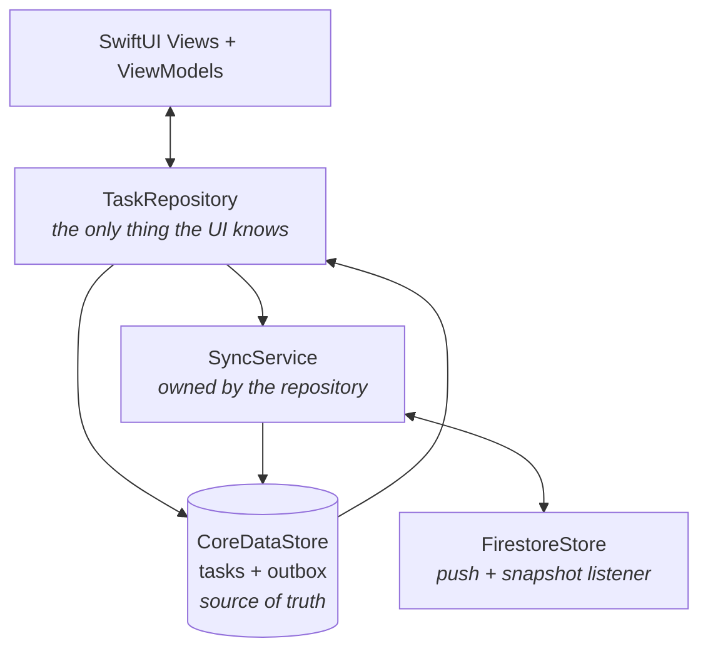
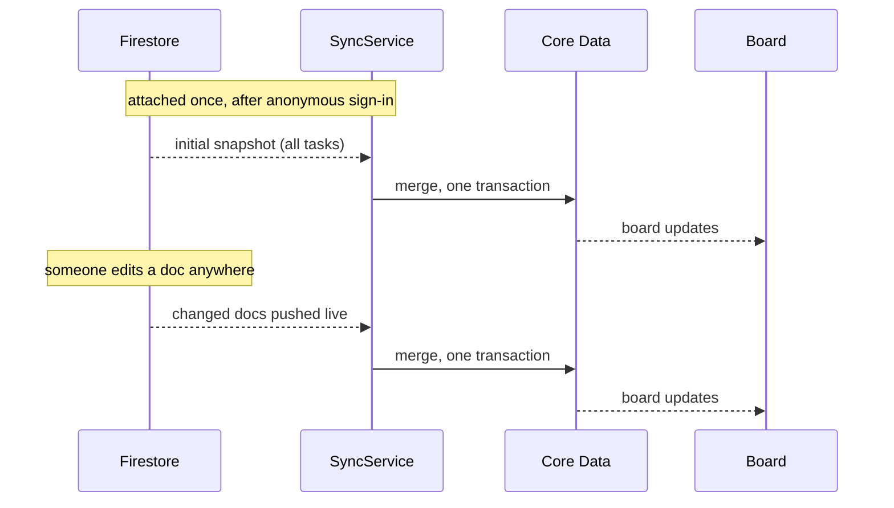
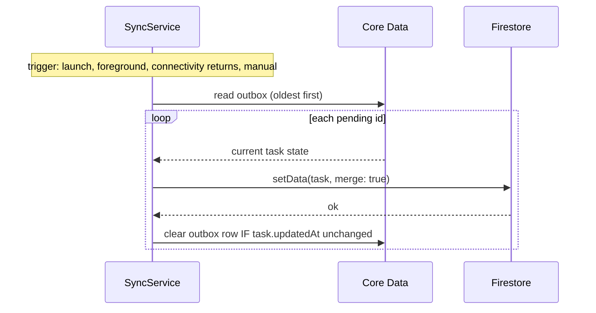

# Tackle — Architecture

Offline-first iOS task board. SwiftUI + Core Data + Firebase Firestore. iOS 17+.

Companion docs: [`FIREBASE.md`](FIREBASE.md) · [`SCREENS.md`](SCREENS.md) · [`BUILD-PLAN.md`](BUILD-PLAN.md)

---

## 1. The one rule

**Core Data is the source of truth. The UI reads only from Core Data. Firebase is a background
sync target that can never block the screen.**

Consequences:

- Every edit saves locally first and appears instantly, online or not.
- No loading screen — the database answers immediately.
- No error screen when Firestore is unreachable — cached tasks stay on screen.
- No Retry button — sync retries itself.

---

## 2. Three layers



| Layer | Job |
|---|---|
| **Views / ViewModels** | Render state, send user intent. No logic. |
| **Router** | Owns navigation state. Views never construct destinations. |
| **TaskRepository** | The only data API the UI sees. Saves locally, queues a push, exposes a live stream. |
| **CoreDataStore** | Persists tasks and the outbox. Single writer context. |
| **SyncService** | Pushes the outbox; merges the live remote stream. |
| **FirestoreStore** | Talks to Firestore. Nothing above it knows Firebase exists. |

Three data protocols: `TaskRepositoryProtocol`, `LocalStoreProtocol`, `RemoteStoreProtocol`.

---

## 3. Navigation — the Router

Two screens don't need this. It's here because the cost is about fifteen lines and the benefit
arrives the moment a third screen does.

```swift
enum Route: Hashable {
    case editor(TaskItem?)      // nil = new task
    // future: .settings, .taskDetail(UUID), .debugPanel
}

@Observable
final class Router {
    var path = NavigationPath()     // pushed destinations
    var sheet: Route?               // modal presentation

    func present(_ route: Route) { sheet = route }
    func push(_ route: Route)    { path.append(route) }
    func pop()                   { if !path.isEmpty { path.removeLast() } }
    func dismiss()               { sheet = nil }
}
```

`BoardView` binds `NavigationStack(path:)` and `.sheet(item:)` to the Router and owns a single
`destination(for:)` mapping. ViewModels call `router.present(.editor(nil))` — they never know what
a `TaskEditorView` is.

What this buys when the app grows: a new screen is a new `Route` case plus one line in the
destination switch; deep links get one entry point instead of being threaded through views; and
navigation becomes assertable in tests (`#expect(router.sheet == .editor(nil))`) without rendering
anything.

What it deliberately isn't: a Coordinator hierarchy. One object, an enum, no per-screen
coordinators, no delegate chains.

---

## 4. Models

```swift
// NOTE: named TaskItem, not Task — `Task` collides with Swift Concurrency.
struct TaskItem: Identifiable, Equatable, Sendable {
    let id: UUID              // client-generated; doubles as the Firestore document ID
    var title: String
    var details: String
    var status: TaskStatus    // .todo / .inProgress / .done
    var sortIndex: Double
    let createdAt: Date
    var updatedAt: Date
    var isDeleted: Bool       // soft delete
    var isSynced: Bool        // DERIVED — no outbox entry for this id
}

enum TaskStatus: String, CaseIterable, Sendable { case todo, inProgress, done }

/// The outbox. Just an id — see §5.
struct PendingPush: Identifiable, Sendable {
    let id: UUID
    let taskId: UUID
    let queuedAt: Date
    var pushedUpdatedAt: Date?   // set while a push is in flight
}
```

`isSynced` is **derived at read time** — a task is synced if no outbox row references it. Never
stored. Nothing can set it wrongly because nothing sets it.

---

## 5. Why the outbox is just a list of IDs

Firestore writes are **upserts of a whole document**. So create, update and delete are the same
remote call: *write this task's current state* (delete is a `deleted: true` field).

That removes, in one stroke:

- operation kinds (`.create` / `.update` / `.delete`)
- stored payloads
- coalescing rules — pushing current state twice is a no-op
- replay ordering problems
- duplicate-create risk — the UUID is the document ID, so a repeated write overwrites itself

The outbox is a set of task IDs that need pushing. Editing the same task five times offline leaves
one row.

---

## 6. Protocols

```swift
protocol TaskRepositoryProtocol: Sendable {
    var tasks: AsyncStream<[TaskItem]> { get }   // live, ordered, excludes deleted

    func create(title: String, details: String, status: TaskStatus) async throws
    func update(_ task: TaskItem) async throws
    func delete(_ id: UUID) async throws
    func move(_ id: UUID, to status: TaskStatus, above: UUID?, below: UUID?) async throws
    func sync() async                            // never throws to the UI
}

protocol LocalStoreProtocol: Sendable {
    var tasks: AsyncStream<[TaskItem]> { get }
    func fetchAll() async throws -> [TaskItem]

    /// Saves the task and queues a push, in ONE transaction.
    func save(_ task: TaskItem) async throws

    func pendingPushes() async throws -> [PendingPush]
    func pendingTaskIds() async throws -> Set<UUID>
    func markPushing(_ push: PendingPush, updatedAt: Date) async throws
    func clearPush(_ id: UUID) async throws

    /// Applies remote tasks in ONE transaction.
    func mergeRemote(_ tasks: [TaskItem]) async throws
}

protocol RemoteStoreProtocol: Sendable {
    func push(_ task: TaskItem) async throws

    /// Live stream from Firestore. First value is the full snapshot,
    /// then one value per remote change. Replaces polling entirely.
    func remoteChanges() -> AsyncStream<[TaskItem]>
}
```

---

## 7. Sync: one push loop, one live inbound stream

Two independent halves. Outbound is a loop you trigger; inbound is a Firestore **snapshot
listener** that pushes to you.

### Inbound — real-time, not polling

`FirestoreStore.remoteChanges()` wraps `addSnapshotListener` on `users/{uid}/tasks`. The first
value is the full collection; after that Firestore delivers every change as it happens — including
changes made from another device or typed directly into the Firebase console.

This **removes** state rather than adding it: no `lastSyncedAt`, no incremental `updatedAt >` query,
no polling schedule. Attaching the listener *is* the initial fetch.



### Outbound — the push loop



### Merge rule — still two lines

1. Task has an outbox entry → **skip it**. Local wins until its push lands.
2. Otherwise → take the remote version if `remote.updatedAt > local.updatedAt`. If the remote says
   `deleted`, remove it locally.

There is no "absent from remote means deleted" rule, because Firestore soft-deletes. That was the
most dangerous rule in the earlier design, and soft delete removes it entirely.

**Why the listener doesn't need push/pull ordering.** With polling you had to push before pulling
or stale server data would overwrite queued edits. The listener fires whenever it likes, so that
ordering can't be enforced — and doesn't need to be, because rule 1 already protects any task with
an outbox row. The same rule that made the old ordering safe makes the ordering unnecessary.

**Echo.** Every push comes straight back through the listener. It's harmless: while the outbox row
exists, rule 1 skips it; once cleared, the echoed document has exactly the `updatedAt` we wrote, so
`remote.updatedAt > local.updatedAt` is false and it's ignored. No special-casing.

**Retry.** A failed push leaves its outbox row in place and the loop ends. The next trigger tries
again. No backoff timer, no attempt counter, no give-up state. Nothing is lost because a row only
clears on success.

---

## 8. Race conditions and how each is closed

| Race | Closed by |
|---|---|
| Two push loops overlapping | One `isPushing` flag in the `SyncService` actor. A second call returns immediately. **Actors are reentrant across `await`, so isolation alone is not enough — the flag is required.** |
| User edits a task while its push is in flight | On success, clear the outbox row **only if `task.updatedAt` still equals the value we pushed**. If it changed, leave it queued. |
| Listener delivers while a push is in flight | Merge rule 1 — any task with an outbox row is skipped. This is why the listener needs no ordering guarantee. |
| Listener echoes our own write back | Once the outbox row clears, the echoed doc carries the `updatedAt` we wrote, so it fails the `>` test and is ignored. |
| Listener and push loop writing Core Data at once | Both go through the single writer context; the merge is one transaction. |
| Two contexts writing Core Data | All writes go through **one background writer context**. |
| Sync state disagreeing with reality | `isSynced` is derived, never stored. |
| Duplicate task from a retried push | The UUID is the Firestore document ID; a repeated write overwrites itself. |
| App killed mid-push | The outbox row was never cleared, so it pushes again next launch. Harmless — the write is idempotent. |
| UI flicker during merge | Merge applies in one transaction and publishes once. |

**Concurrency rule:** `NSManagedObject` never leaves `CoreDataStore`. Everything above it uses
`TaskItem` structs. `SyncService` and `FirestoreStore` are actors; ViewModels are `@MainActor`.

---

## 9. Sort index

Fractional. Pure function, unit-tested directly:

```swift
enum SortIndex {
    static func between(above: Double?, below: Double?) -> Double
}
```

| Case | Value |
|---|---|
| Empty section | `1024` |
| Top (`above == nil`) | `below - 1024` |
| Bottom (`below == nil`) | `above + 1024` |
| Between | `(above + below) / 2` |

Known limitation: doubles run out after ~50 splits between the same pair. Not handled; documented.

---

## 10. Project structure

```
Tackle/
  App/
    TackleApp.swift
    AppContainer.swift          the only place concrete types are named
  Models/
    TaskItem.swift, TaskStatus.swift, PendingPush.swift, SortIndex.swift
  Protocols/
    TaskRepositoryProtocol.swift, LocalStoreProtocol.swift, RemoteStoreProtocol.swift
  Navigation/
    Route.swift, Router.swift
  Local/
    Tackle.xcdatamodeld         CDTask + CDPendingPush (from the Xcode template)
    CoreDataStack.swift         container + single writer context
    CoreDataStore.swift
  Remote/
    FirestoreStore.swift
    FirebaseBootstrap.swift     configure + anonymous sign-in
  Sync/
    SyncService.swift
    NetworkMonitor.swift
  Features/
    Board/       BoardView, BoardViewModel, TaskRow, StatusPill
    Editor/      TaskEditorView, TaskEditorViewModel
  Theme/
    Theme.swift                 colours from SCREENS.md §4
TackleTests/
  Fakes/
    FakeRemoteStore.swift, FakeNetworkMonitor.swift   (Part 3)
  TackleTests.swift             domain + repository + sync suites
TackleUITests/                  template target, unused by this plan — left untouched
```

Everything above `Tackle/Assets.xcassets` and the two test targets already exists from the Xcode
template; `PART1.md §0` is the step that turns the template layout into this one.

---

## 11. What was deliberately cut

To keep this buildable in the time available, and because none of it earns its place:

- Coordinator hierarchies — one `Router` object and a `Route` enum is the whole abstraction
- Operation kinds, payloads, a Coalescer — upserts make them unnecessary
- Backoff policy type and attempt counters — the next trigger retries
- Polling and `lastSyncedAt` — the snapshot listener replaces both
- Retryable vs terminal error taxonomy — a failed push simply stays queued
- Escalating status text ("last tried 09:41")
- A generic networking layer — the Firebase SDK is the transport
- Firestore's own offline persistence — **explicitly disabled** (see `FIREBASE.md §2`); two offline
  queues would fight each other

---

## 12. Known limitations

- Sort index precision exhausts after ~50 splits between the same two rows.
- Last-write-wins by `updatedAt`; a concurrent edit on another device loses silently.
- Soft-deleted documents are never purged from Firestore.
- Single anonymous user; no sign-in UI, no multi-device account.

---

*Tackle Architecture · v2 simplified · September 2026*
