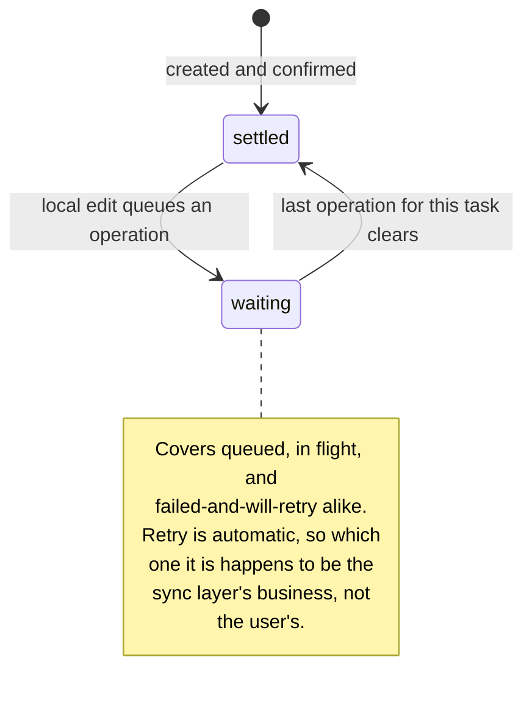

# Tackle — UI Specification

Offline-first task board for iOS. SwiftUI, iOS 17+.

Every design decision below is grounded in Apple's Human Interface Guidelines and cited as
`file.md › Heading`, referring to the HIG pages at
<https://developer.apple.com/design/human-interface-guidelines>.

Companion documents: [`ARCHITECTURE.md`](ARCHITECTURE.md) · [`FIREBASE.md`](FIREBASE.md) · [`BUILD-PLAN.md`](BUILD-PLAN.md).

---

## 1. The governing principle: offline is a mode, not an error

The brief requires the app to *"remain usable when network connectivity is unavailable"* and that
people are *"not blocked from working when that service cannot be reached."* Read strictly, that
rules out a whole category of design most apps reach for by default.

**Core Data is the source of truth. The UI reads from it and nothing else. The network is an
enhancement that runs behind the screen, and can never gate what the user sees.**

Three consequences, each of which removed something from this spec:

| Removed | Why |
|---|---|
| Full-screen "unable to load" error | Hiding content the user already has, to report that a server they don't care about is unreachable, is exactly the blocking the brief forbids. |
| Loading screen / skeleton | Reading Core Data is instantaneous. An empty database renders instantly as an empty board. A skeleton would be pretending to load rows that may not exist. |
| Retry button | An offline-first app that asks people to press Retry has handed them its own job. The engine drains the queue by itself when connectivity returns. |

What's left is an app that never blocks you, never asks you to fix anything, and never shows a
state that isn't real.

---

## 2. Sync state: two states, derived

A task is **settled** or **waiting**. There is nothing in between, and nothing else is shown.

The state is not stored on the task — it is derived from the outbox: a task is waiting if and only
if there are unsent operations for it. (`ARCHITECTURE.md §3` explains why storing it would be a
bug, and how that bug would surface as a row claiming to be synced while carrying an unsent edit.)

| State | What the user sees | VoiceOver |
|---|---|---|
| `isSynced == true` | *nothing*, and a solid stage rail | — |
| `isSynced == false` | Clock glyph, translucent rail | "Waiting to sync" |



A failed push is the sync layer's private business, not a user-facing condition. The outbox row
simply stays put and the next sync trigger tries again, so waiting honestly means "not yet" — and
dressing that in red would be a lie about a queue that is still working.

**Why not a coloured dot.** `accessibility.md › Vision`: *"Offer visual indicators, like distinct
shapes or icons, in addition to color to help people perceive differences in function and changes
in state."* Colour alone fails. Every state carries a glyph and a VoiceOver label; the rail is
reinforcement, never the sole signal.

**Why nothing at all when synced.** `feedback.md`: *"people typically expect their action or task
to succeed, they only need to know when it doesn't."* A tick on every row is noise.

**Where status lives.** On the row it describes. `feedback.md › Best practices`: *"When status
feedback is available near the items it describes, people get important information without having
to take action or leave their current context."*

---

## 3. The signature: colour that settles

Every task board has stages. Only this one has tasks written locally and not yet confirmed by the
server. So sync state rides on the same colour that carries the stage:

**A row whose change is queued shows its stage rail translucent. The rail becomes solid the moment
the server confirms it.** Colour fills in when work lands.

One mechanism doing two jobs, specific to this product, roughly three lines of SwiftUI. It is
delight as meaning rather than decoration — the distinction Apple's Delight principle insists on.

---

## 4. Palette

Three hues, held at matched chroma and lightness so they read as one family rather than a clash.
Each is tied to a workflow stage, so colour tells you where work sits before you read a word.

| Role | Light | Contrast on white | Dark |
|---|---|---|---|
| Canvas | `#F4F3F8` | — | `#0E0E13` |
| Card | `#FFFFFF` | — | `#1A1A22` |
| Label | `#1A1A24` | 17.3:1 | `#F2F1F7` |
| Label secondary | `#6E6C7E` | 5.1:1 | `#9C9AAC` |
| Tint / interactive | `#4E5BC6` | 5.8:1 | `#A3ABF2` |
| To Do — periwinkle | `#5A64B0` | 5.4:1 | `#A8B0EA` |
| In Progress — bronze | `#9A5E12` | 5.3:1 | `#E8B569` |
| Done — sage | `#3F7A5E` | 5.1:1 | `#86C7A4` |
| Destructive — **Delete only** | `#C4453D` | 4.9:1 | `#FF8A80` |

Every text colour clears 4.5:1, the floor `accessibility.md › Vision` sets for text up to 17pt.
Dark mode re-picks each hue for a dark ground rather than inverting, so the family survives the
switch and every ratio still clears AA.

The neutrals are not pure grey — they carry a faint violet bias toward the tint. That is the
difference between a palette that was chosen and one that was inherited.

**The danger colour appears in exactly one place in the entire app: Delete.**

---

## 5. Type and motion

SF throughout, with `.fontDesign(.rounded)` on the large title and section headers. Rounded reads
warmer without leaving the system, so Dynamic Type, optical sizing and every accessibility size
still come free. Brand lives in the colour and the one moment; navigation and controls stay system.

Exactly one animation: the rail filling and the clock glyph cross-fading out when a row syncs.
Brief, purposeful, on an event that happens rarely — the bar `motion.md` sets.

---

## 6. Layout: the floating action button

Creating a task is the most frequent action, so it sits in the most reachable place.
`designing-for-ios.md`: *"it tends to be easier and more comfortable for people to reach a control
when it's located in the middle or bottom area of the display."*

> **A guideline that looks contradictory and isn't:** `layout.md` says to avoid controls at the
> bottom of a *window*. That sits in the macOS section, and the reason given is that people drag
> windows below the screen edge. It has no bearing on a phone.

`liquid-glass.md › The two layers` describes exactly two: the content layer, and a *functional
layer* of *"controls that float above the content."* A floating action button is the canonical
inhabitant of that layer on iOS 26 — not a foreign import. What reads as Android is the *Material
execution*: elevation ramp, ripple, Material iconography.

What makes this one native:

- **Tinted background, not a coloured symbol.** `liquid-glass.md › Color on glass`: emphasise a
  primary action by colouring the background, which is how the system draws prominent buttons.
- **The only tinted control on screen.** Same page: *"one, at most two, tinted primary actions per
  view."*
- **Monochrome SF `plus`**, 54pt across, clearing the 44pt minimum with room, inset from both
  safe-area edges.
- **Content fades beneath it** rather than colliding — the scroll edge effect.
- No custom background: on iOS 26 the material is applied by the system.

### The status capsule

A small glass capsule, bottom-left, mirroring the button. It obeys the same rule as the rails:
**it only appears when there is something to say.** All synced, and it is not there at all.

Two floating surfaces is within the material's restraint budget, and one of them is usually absent.

---

## 7. Screens

### 7.1 Board

```
┌──────────────────────────────┐
│ 9:41                      ▭  │
│                              │
│  Tasks                 Edit  │   large title, .rounded
│                              │
│  ● TO DO                  3  │   dot + label in stage colour, count trailing
│  ┌────────────────────────┐  │
│  ││ Draft Q3 retro notes  │  │   solid rail = synced
│  ││ Pull metrics first    │  │
│  ├────────────────────────┤  │
│  ┊│ Book venue         🕐 │  │   translucent rail + clock = queued
│  ├────────────────────────┤  │
│  ││ Renew SSL certificate │  │
│  └────────────────────────┘  │
│                              │
│  ● IN PROGRESS            2  │
│  ┌────────────────────────┐  │
│  ││ Migrate billing svc   │  │
│  └────────────────────────┘  │
│                              │
│  ● DONE                   2  │
│  ┌────────────────────────┐  │
│  ││ Ship crash-rate fix   │  │   secondary label colour
│  └────────────────────────┘  │
│                        ╭───╮ │
│                        │ + │ │   tinted, 54pt
│                        ╰───╯ │
└──────────────────────────────┘
```

Inset-grouped `List` with three sections. Stage colour reads before the words do.
`lists-and-tables.md › Style`.

### 7.2 Offline, changes queued

Identical to the board, plus the status capsule at bottom-left:

```
  ╭──────────────────────╮        ╭───╮
  │ 🕐 Offline · 3 waiting│        │ + │
  ╰──────────────────────╯        ╰───╯
```

Three translucent rails tell the story at a glance before you read the capsule. Everything is still
editable; nothing is disabled, greyed out, or asking to be fixed. **This is the app working as
designed, not degraded.**

### 7.3 Edit mode and row actions

- **Reorder within a section:** standard edit-mode grabber (`≡`), `.onMove`.
- **Move between sections:** explicit action — swipe, or the status picker in the editor. Not a
  cross-section drag; that is hours of SwiftUI work the brief does not ask for.
- **Swipe actions:** `Move` (tint) and `Delete` (danger). The only two places those colours appear
  as fills.

### 7.4 Task editor

Presented as a sheet. One short task, an obvious way out. `modality.md`.

```
┌──────────────────────────────┐
│        ▁▁▁▁  (grabber)       │
│  Cancel    New Task    Save  │
│                              │
│  TITLE                       │
│  ┌────────────────────────┐  │
│  │ What needs doing?      │  │   placeholder describes the input
│  └────────────────────────┘  │
│  DESCRIPTION                 │
│  ┌────────────────────────┐  │
│  │ Add detail (optional)  │  │
│  └────────────────────────┘  │
│  STATUS                      │
│  ┌──────┬────────┬────────┐  │
│  │To Do │In Prog.│  Done  │  │   selected segment takes the stage colour
│  └──────┴────────┴────────┘  │
└──────────────────────────────┘
```

The selected segment takes its stage colour, so choosing a status previews where the task will land.

Placeholder text describes the input rather than scolding for it — `writing.md › Best practices`:
*"use hint or placeholder text so people know how to format the information."*

### 7.5 Empty — and first launch

One screen covers both. There is **no loading state**: an empty database renders instantly as an
empty board.

```
┌──────────────────────────────┐
│  Tasks                       │
│                              │
│           ┌─────┐            │
│           │  ▤  │            │   badge in To Do tint
│           └─────┘            │
│         No tasks yet         │
│   Create your first task to  │
│   start tracking work across │
│   To Do, In Progress, Done.  │
│                              │
│ ╭────────────────────╮ ╭───╮ │
│ │ ↻ Checking for…    │ │ + │ │
│ ╰────────────────────╯ ╰───╯ │
└──────────────────────────────┘
```

The capsule admits the one thing the app genuinely doesn't know yet — whether the server has
anything — and disappears the moment it finds out. Without it, a first launch with forty tasks on
the server would briefly claim "No tasks yet", which is false.

**No duplicate button in the centre.** The floating action is already the most reachable control on
screen; Reminders solves it the same way. The badge takes the To Do tint — the stage a new task
actually lands in. Structure encoding information, not a decorative illustration.

### 7.6 Reconnected, draining the queue

Connectivity returned and the engine started replaying on its own. Rails are mid-transition: some
rows still in flight, others landed and gone solid. Capsule reads `↻ Syncing…`.

**Nobody pressed anything.** This is the whole point of the offline queue, and the user's only job
is to notice it finished.

### 7.7 Dark appearance

Same structures, semantic colours only — no hard-coded hex, no in-app appearance toggle.
`dark-mode.md`. Each hue is re-picked for a dark ground rather than inverted.

---

## 8. Every string, written once

Fixing copy late is how inconsistency ships. These are final.

| Where | String |
|---|---|
| Empty title | No tasks yet |
| Empty body | Create your first task to start tracking work across To Do, In Progress and Done. |
| Local save failure | Unable to save changes |
| Status capsule, all synced | *absent — no capsule at all* |
| Status capsule, first launch | Checking for tasks… |
| Status capsule, queued | Offline · `{n}` waiting |
| Status capsule, draining | Syncing… |
| Floating button a11y label | New Task |
| VoiceOver, unsynced row | Waiting to sync |
| Delete confirmation | Delete Task / Cancel |
| Title placeholder | What needs doing? |
| Description placeholder | Add detail (optional) |

**Never "we".** `writing.md › Best practices` names *"We're having trouble loading this content"*
as the anti-pattern and *"Unable to load content"* as the fix.

Capitalisation: title-style on buttons and titles, sentence case in body text, applied consistently.

---

## 9. Accessibility floor

Non-negotiable for the build, all from `accessibility.md › Vision` and `› Mobility`:

- Body text 17pt default, never below 11pt
- Contrast 4.5:1 for text up to 17pt; 3:1 at 18pt or bold
- Tap targets 44×44pt, ~12pt padding between controls
- Layouts survive the largest Dynamic Type size with hierarchy intact
- No state conveyed by colour alone
- Every icon-only control has a VoiceOver label
- Reduce Transparency gets an opaque fallback; Reduce Motion drops the rail animation

---

## 10. What this design deliberately doesn't do

| Not doing | Why |
|---|---|
| Full-screen error when the server is unreachable | Hides content the user has, to report a problem they were promised wouldn't stop them |
| Loading screen, skeleton or spinner | A state that can never occur — the database answers immediately |
| Retry button, anywhere | Recovery is the engine's job. Only manual gesture is pull to refresh, which is a choice, not a chore |
| Red for sync | A queued change is waiting, not broken |
| Tick on synced rows | Decorating the expected outcome is noise; the solid rail already says it |
| Material FAB | The floating circle is right for iOS 26; the elevation shadow, ripple and Material glyph are not |
| A second tinted button | One prominent action per view |
| Custom font | SF with a rounded design keeps Dynamic Type and optical sizing free |
| Horizontal Kanban | Cross-column drag is hours of SwiftUI the brief doesn't ask for |
| Custom visual identity beyond the palette | The rubric is architecture; a bespoke design language costs hours and looks less native |

---

## 11. Build cost

A colour asset catalogue with light and dark variants, a 3pt `Capsule` as each row's leading
element, `.fontDesign(.rounded)` on two text styles, one `withAnimation` on the sync transition,
and `ToolbarItem(placement: .bottomBar)` replaced by an overlaid button.

Roughly forty minutes. None of it touches the architecture.

---

*Tackle Screens · Final · drawn against Apple HIG, September 2026*
